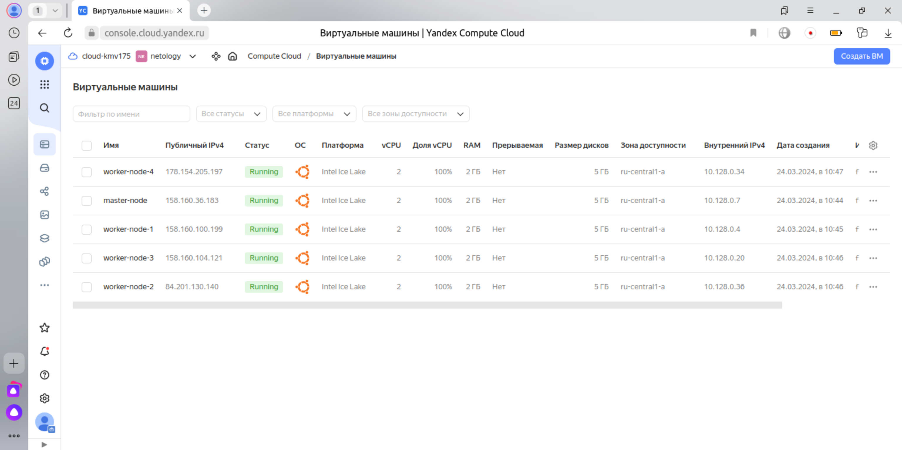
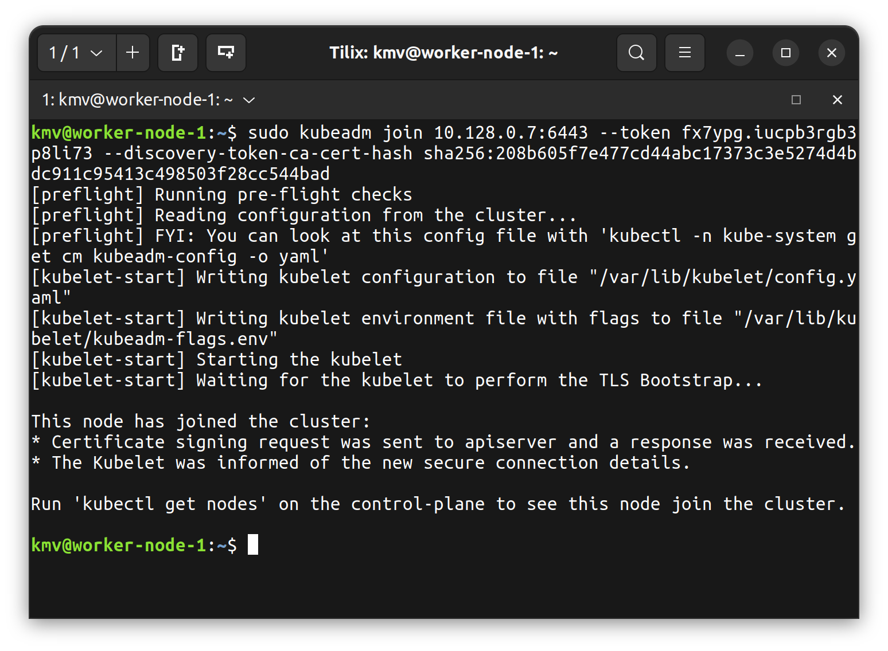
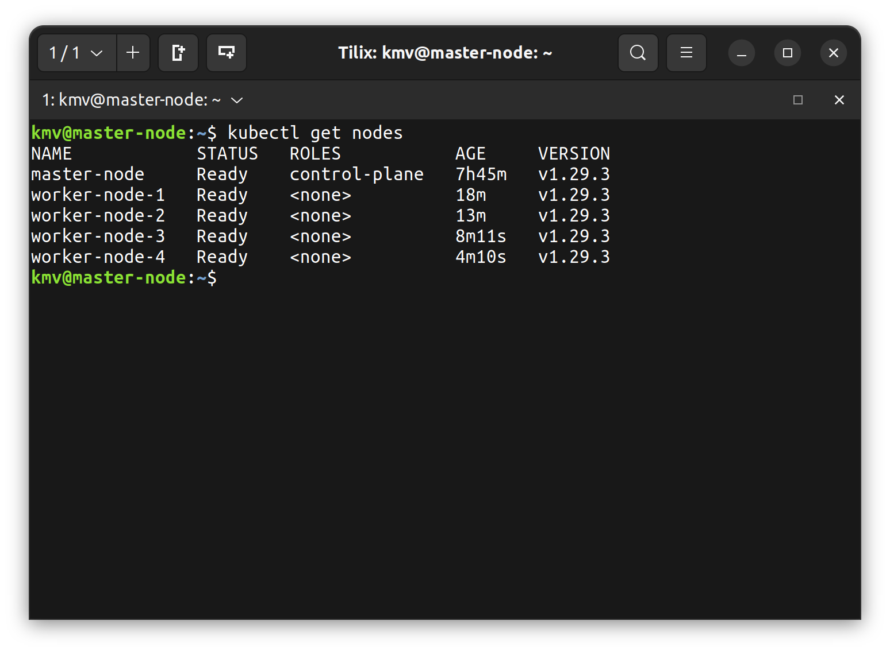

# Домашнее задание к занятию «Установка Kubernetes»

### Цель задания

Установить кластер K8s.

### Задание 1. Установить кластер k8s с 1 master node

1. Подготовка работы кластера из 5 нод: 1 мастер и 4 рабочие ноды.
2. В качестве CRI — containerd.
3. Запуск etcd производить на мастере.
4. Способ установки выбрать самостоятельно.

В Yandex Cloud создано 5 виртуальных машин



На каждой виртуальной машине установлен kubeadm

```
sudo apt update
sudo apt install apt-transport-https ca-certificates curl
sudo mkdir /etc/apt/keyrings
curl -fsSL https://pkgs.k8s.io/core:/stable:/v1.29/deb/Release.key | sudo gpg --dearmor -o /etc/apt/keyrings/kubernetes-apt-keyring.gpg
echo 'deb [signed-by=/etc/apt/keyrings/kubernetes-apt-keyring.gpg] https://pkgs.k8s.io/core:/stable:/v1.29/deb/ /' | sudo tee /etc/apt/sources.list.d/kubernetes.list
sudo apt update
sudo apt install kubelet kubeadm kubectl containerd
sudo apt-mark hold  kubelet kubeadm kubectl
```

На виртуальной машине master-node инициализирован кластер

```
sudo kubeadm init --apiserver-advertise-address=10.128.0.7 --pod-network-cidr 10.244.0.0/16 --apiserver-cert-extra-sans=158.160.36.183
```

На worker нодах выполнена команда присоединения к кластеру

```
kubeadm join 10.128.0.7:6443 --token fx7ypg.iucpb3rgb3p8li73 \
	--discovery-token-ca-cert-hash sha256:208b605f7e477cd44abc17373c3e5274d4bdc911c95413c498503f28cc544bad
```




## Дополнительные задания (со звёздочкой)

**Настоятельно рекомендуем выполнять все задания под звёздочкой.** Их выполнение поможет глубже разобраться в материале.   
Задания под звёздочкой необязательные к выполнению и не повлияют на получение зачёта по этому домашнему заданию. 

------
### Задание 2*. Установить HA кластер

1. Установить кластер в режиме HA.
2. Использовать нечётное количество Master-node.
3. Для cluster ip использовать keepalived или другой способ.

### Правила приёма работы

1. Домашняя работа оформляется в своем Git-репозитории в файле README.md. Выполненное домашнее задание пришлите ссылкой на .md-файл в вашем репозитории.
2. Файл README.md должен содержать скриншоты вывода необходимых команд `kubectl get nodes`, а также скриншоты результатов.
3. Репозиторий должен содержать тексты манифестов или ссылки на них в файле README.md.
