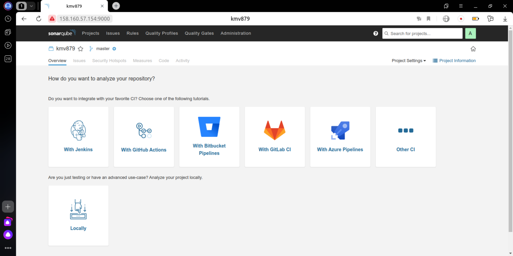
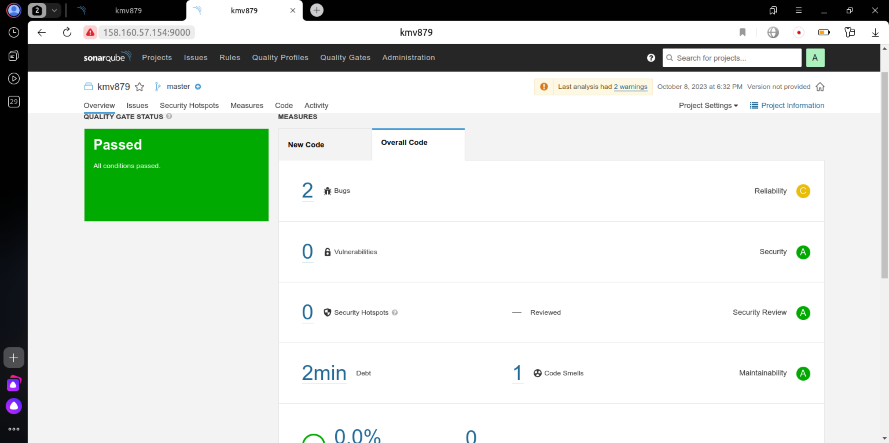
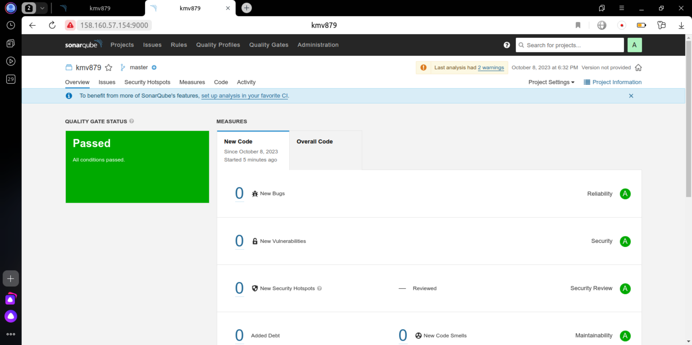
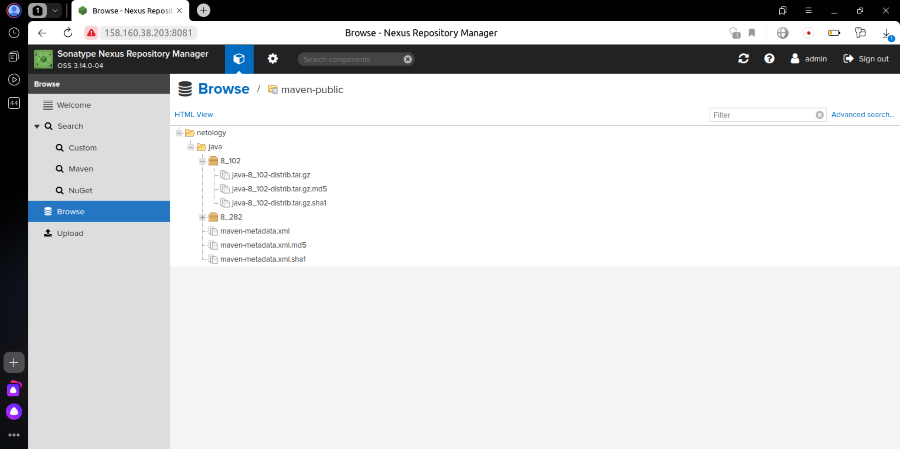

# Домашнее задание к занятию "9.Процессы CI/CD"

## Знакомоство с SonarQube

### Основная часть

1. Создаём новый проект, название произвольное



2. Скачиваем пакет sonar-scanner, который нам предлагает скачать сам sonarqube
3. Делаем так, чтобы binary был доступен через вызов в shell (или меняем переменную PATH или любой другой удобный вам способ)
4. Проверяем `sonar-scanner --version`

```
INFO: Scanner configuration file: /vagrant/sonar-scanner/conf/sonar-scanner.properties
INFO: Project root configuration file: NONE
INFO: SonarScanner 5.0.1.3006
INFO: Java 17.0.7 Eclipse Adoptium (64-bit)
INFO: Linux 5.15.0-30-generic amd64
```

5. Запускаем анализатор против кода из директории [example] с дополнительным ключом `-Dsonar.coverage.exclusions=fail.py`

[Вывод анализатора в консоль](./src/sonar_test.txt)

6. Смотрим результат в интерфейсе



7. Исправляем ошибки, которые он выявил(включая warnings)

[Исправленный файл](./fail.py)

8. Запускаем анализатор повторно - проверяем, что QG пройдены успешно




## Знакомство с Nexus

### Основная часть

1. В репозиторий `maven-public` загружаем артефакт с GAV параметрами:
   1. groupId: netology
   2. artifactId: java
   3. version: 8_282
   4. classifier: distrib
   5. type: tar.gz
2. В него же загружаем такой же артефакт, но с version: 8_102
3. Проверяем, что все файлы загрузились успешно



4. В ответе присылаем файл `maven-metadata.xml` для этого артефекта

[Файл maven-metadata.xml](./maven-metadata.xml)

### Знакомство с Maven

### Подготовка к выполнению

1. Скачиваем дистрибутив с [maven](https://maven.apache.org/download.cgi)
2. Разархивируем, делаем так, чтобы binary был доступен через вызов в shell (или меняем переменную PATH или любой другой удобный вам способ)
3. Удаляем из `apache-maven-<version>/conf/settings.xml` упоминание о правиле, отвергающем http соединение( раздел mirrors->id: my-repository-http-unblocker)
4. Проверяем `mvn --version`

```
Apache Maven 3.9.5 (57804ffe001d7215b5e7bcb531cf83df38f93546)
Maven home: /vagrant/maven
Java version: 1.8.0_382, vendor: Private Build, runtime: /usr/lib/jvm/java-8-openjdk-amd64/jre
Default locale: en_US, platform encoding: UTF-8
OS name: "linux", version: "5.15.0-30-generic", arch: "amd64", family: "unix"
```

5. Забираем директорию [mvn](./mvn) с pom

### Основная часть

1. Меняем в `pom.xml` блок с зависимостями под наш артефакт из первого пункта задания для Nexus (java с версией 8_282)
2. Запускаем команду `mvn package` в директории с `pom.xml`, ожидаем успешного окончания

[Вывод maven в консоль](./src/mvn.txt)

3. Проверяем директорию `~/.m2/repository/`, находим наш артефакт
```
vagrant@vagrant:~/.m2/repository/netology/java/8_282$ ls
java-8_282-distrib.tar.gz       java-8_282.pom.lastUpdated
java-8_282-distrib.tar.gz.sha1  _remote.repositories

```

4. В ответе присылаем исправленный файл `pom.xml`

[Файл pom.xml](./pom.xml)
---

