# Домашнее задание к занятию "10.Jenkins"

## Подготовка к выполнению

1. Создать 2 VM: для jenkins-master и jenkins-agent.

С помощью Terraform было создано 2 виртуальные машины

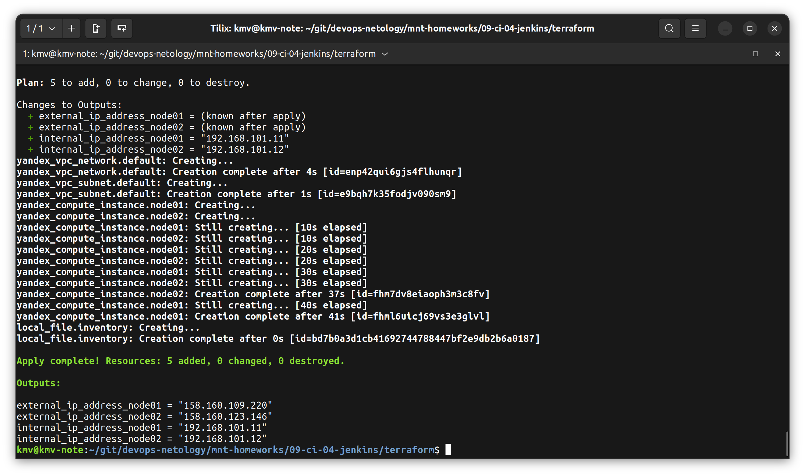

2. Установить jenkins при помощи playbook'a.

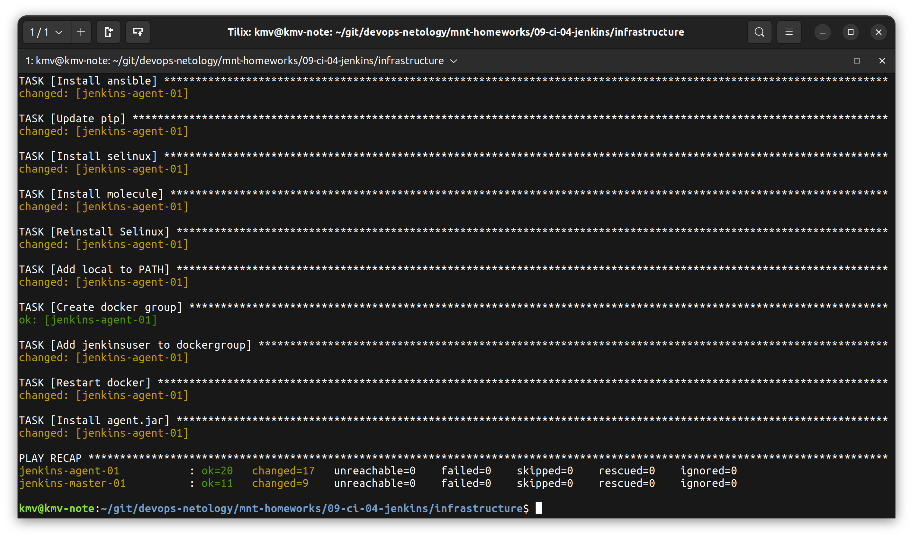

3. Запустить и проверить работоспособность.
4. Сделать первоначальную настройку.

Был настроен агент

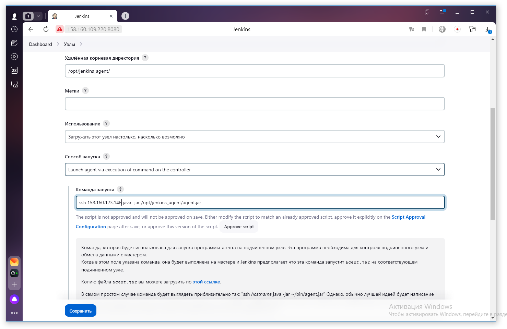

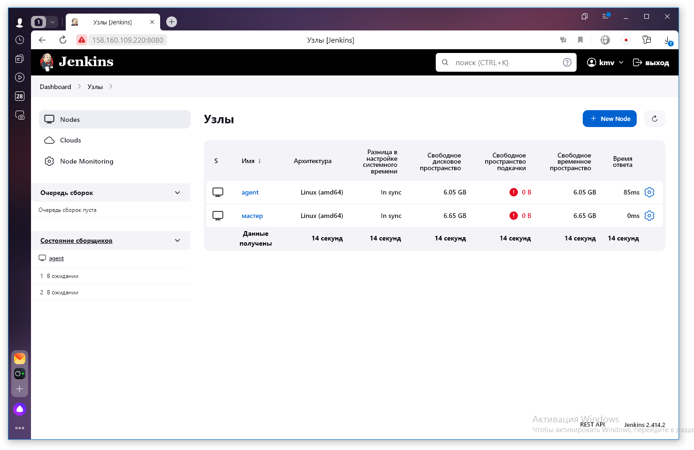

## Основная часть

1. Сделать Freestyle Job, который будет запускать `molecule test` из любого вашего репозитория с ролью.

Freestyle Job запускает `molecule test` роли [vector-role](https://github.com/kmv879/vector-role)

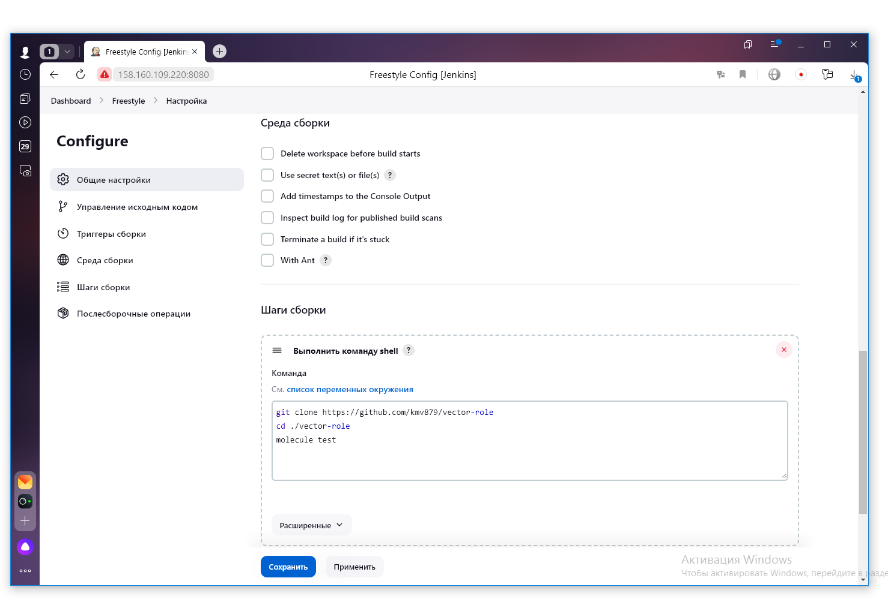

2. Сделать Declarative Pipeline Job, который будет запускать `molecule test` из любого вашего репозитория с ролью.

Declarative Pipeline  Job запускает `molecule test` роли [vector-role](https://github.com/kmv879/vector-role)

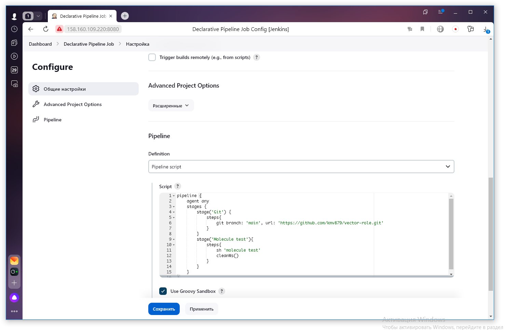

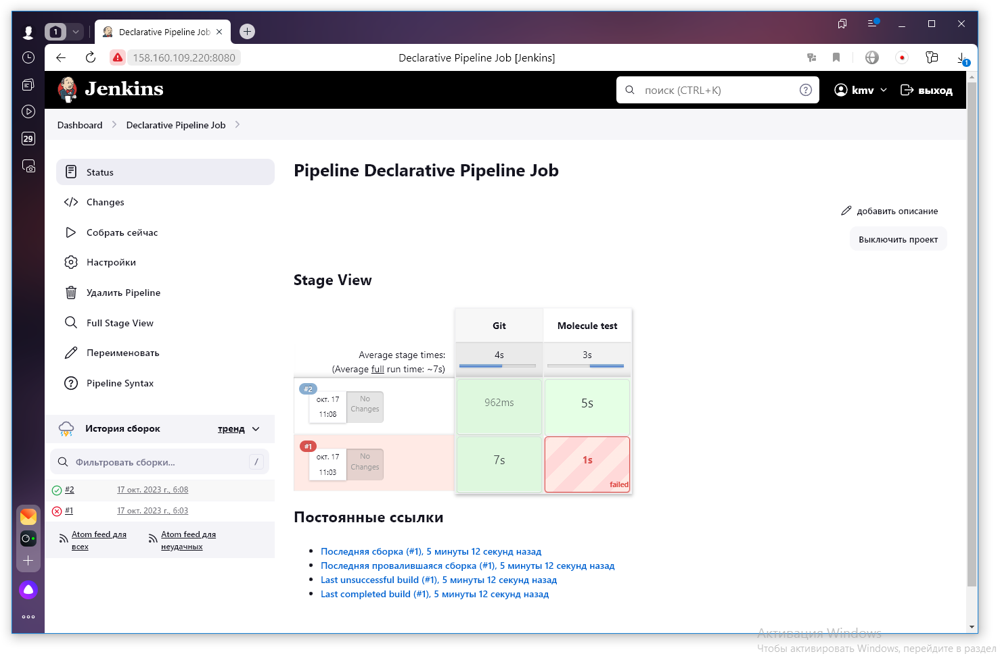

3. Перенести Declarative Pipeline в репозиторий в файл `Jenkinsfile`.

[Jenkinsfile](./Jenkinsfile)

4. Создать Multibranch Pipeline на запуск `Jenkinsfile` из репозитория.

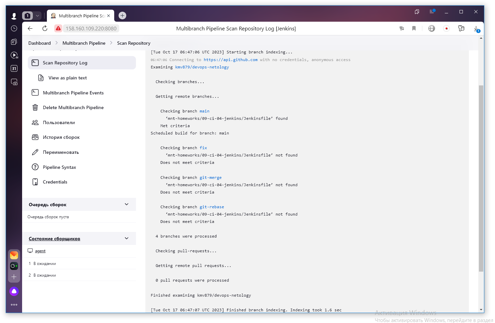

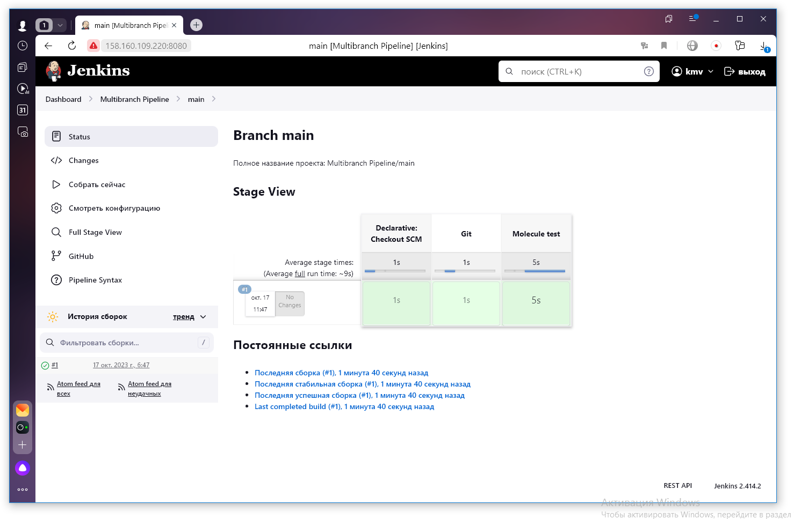

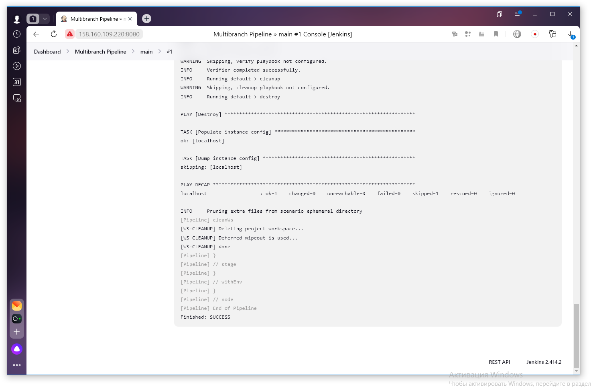

5. Создать Scripted Pipeline, наполнить его скриптом.
6. Внести необходимые изменения, чтобы Pipeline запускал `ansible-playbook` без флагов `--check --diff`, если не установлен параметр при запуске джобы (prod_run = True), по умолчанию параметр имеет значение False и запускает прогон с флагами `--check --diff`.

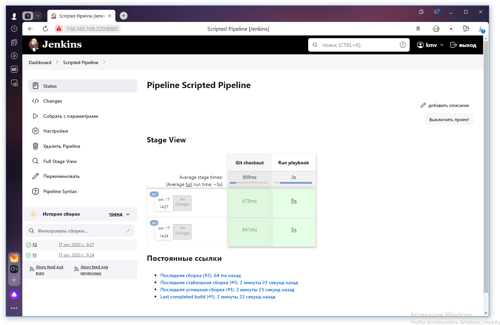

Запуск при prod_run = True

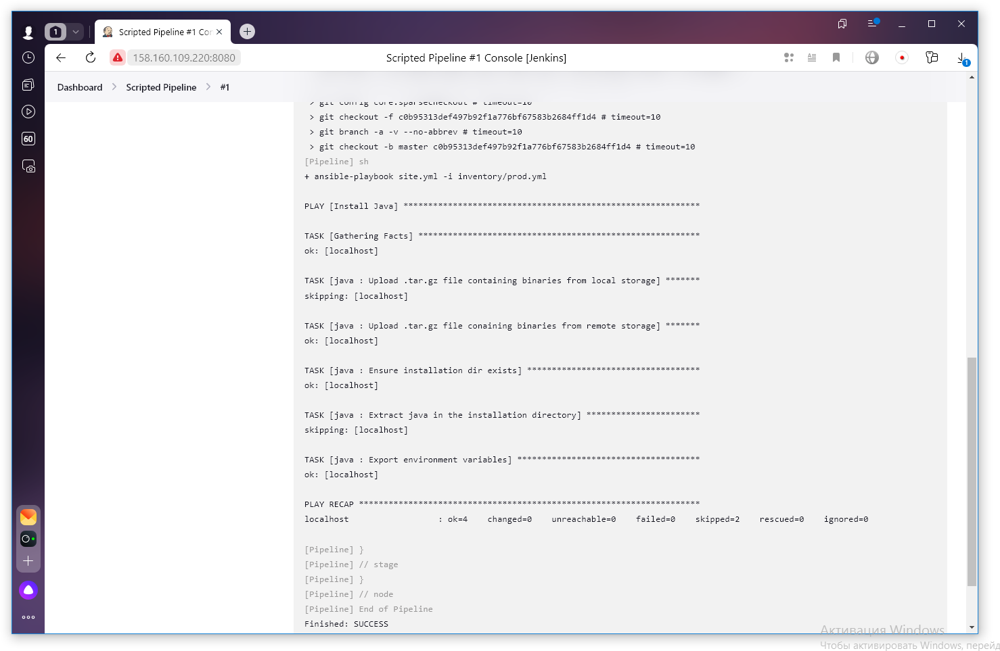

Запуск при prod_run = False

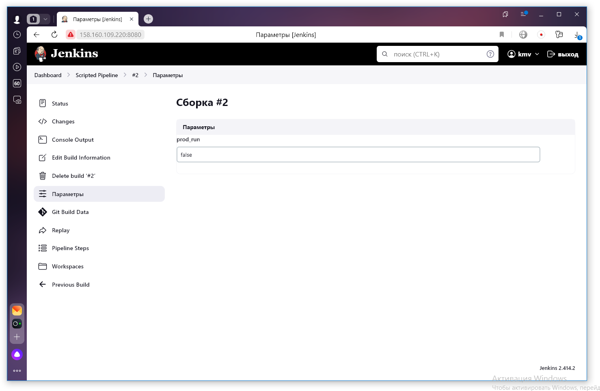

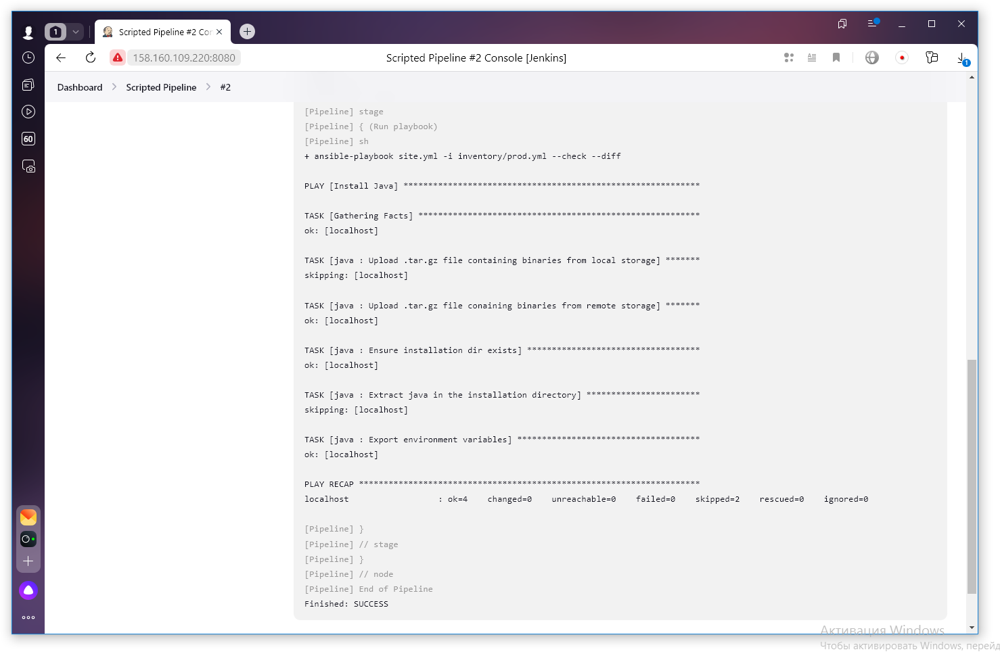

7. Проверить работоспособность, исправить ошибки, исправленный Pipeline вложить в репозиторий в файл `ScriptedJenkinsfile`.

[ScriptedJenkinsfile](./ScriptedJenkinsfile)

---
