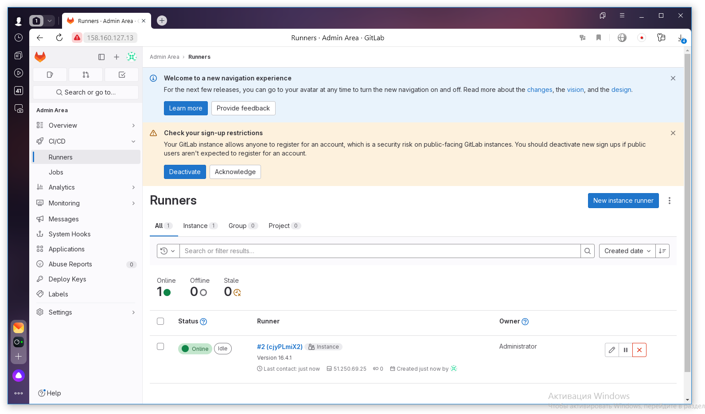
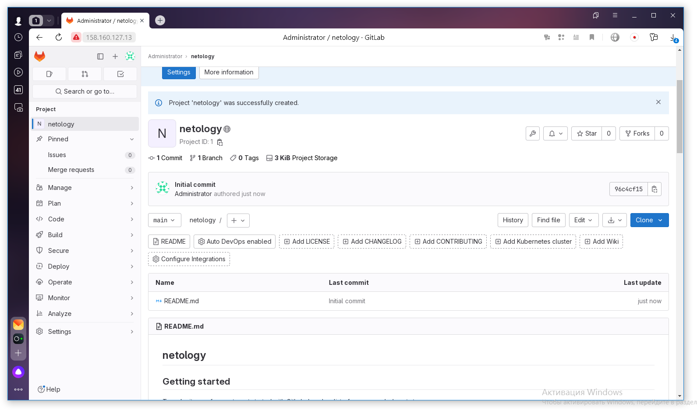
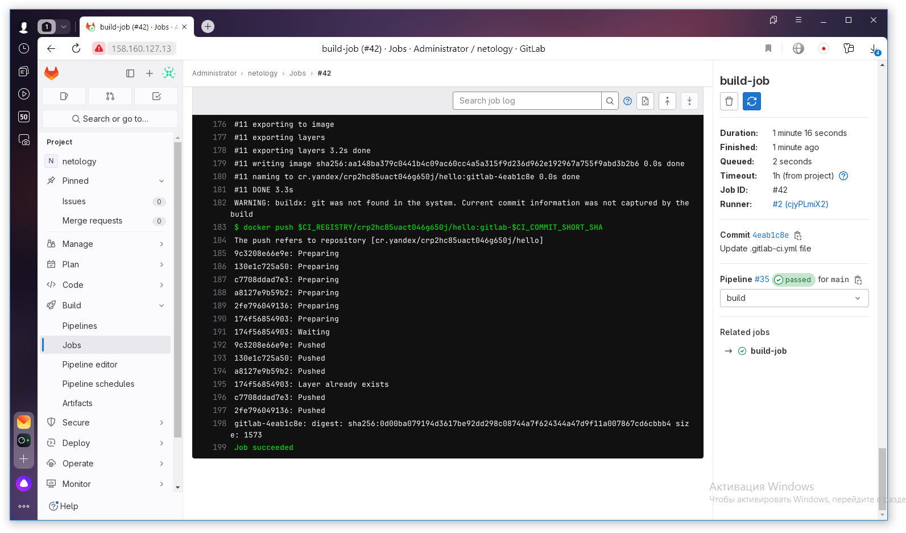
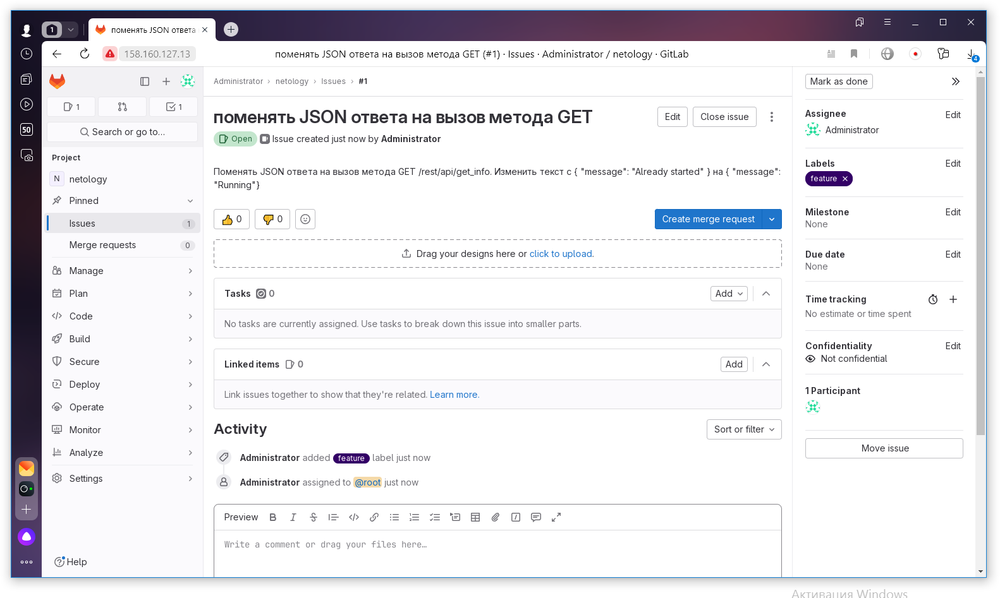
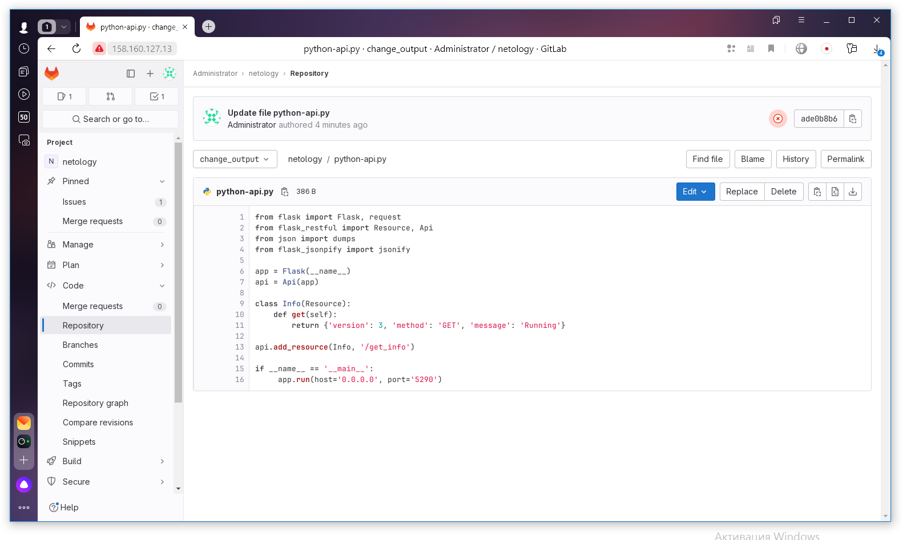
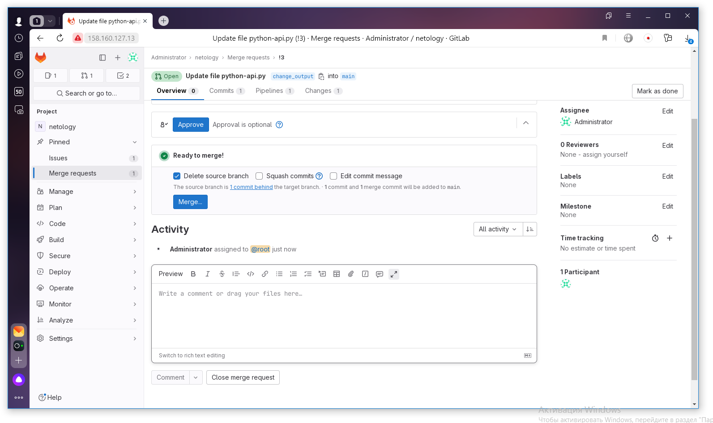
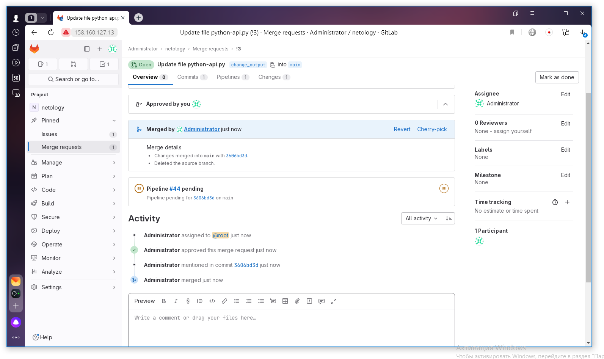
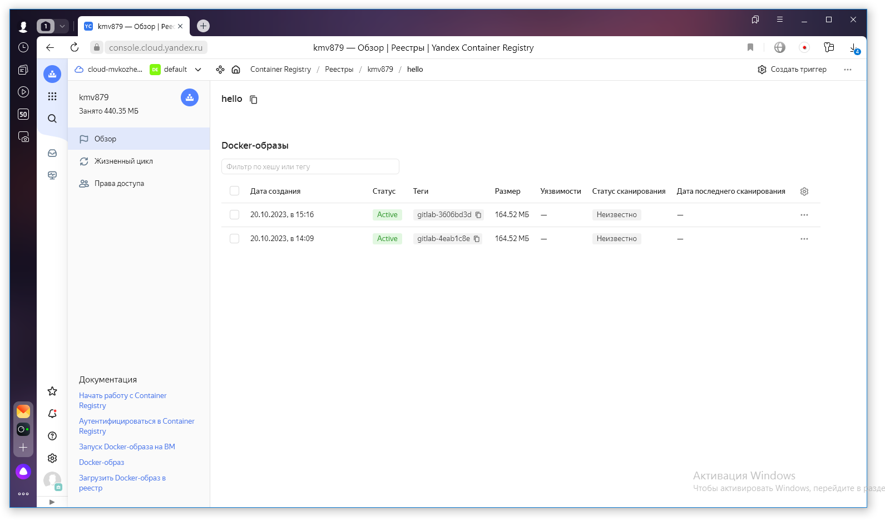
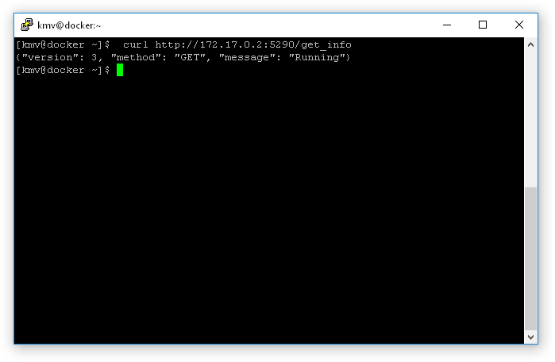
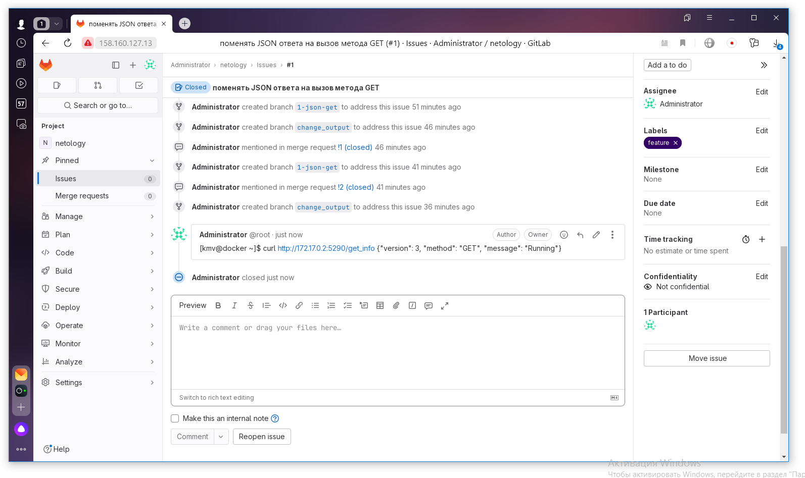

# Домашнее задание к занятию 12 «GitLab»

## Подготовка к выполнению

1. Или подготовьте к работе Managed GitLab от yandex cloud.
Или создайте виртуальную машину из публичного образа .
2. Создайте виртуальную машину и установите на нее gitlab runner, подключите к вашему серверу gitlab

Runner создан и подключен.

3. (* Необязательное задание повышенной сложности. )  Если вы уже знакомы с k8s попробуйте выполнить задание, запустив gitlab server и gitlab runner в k8s  [по инструкции](https://cloud.yandex.ru/docs/tutorials/infrastructure-management/gitlab-containers). 

4. Создайте свой новый проект.

Проект создан

5. Создайте новый репозиторий в GitLab, наполните его [файлами](./repository).
6. Проект должен быть публичным, остальные настройки по желанию.

## Основная часть

### DevOps

В репозитории содержится код проекта на Python. Проект — RESTful API сервис. Ваша задача — автоматизировать сборку образа с выполнением python-скрипта:

1. Образ собирается на основе [centos:7](https://hub.docker.com/_/centos?tab=tags&page=1&ordering=last_updated).
2. Python версии не ниже 3.7.
3. Установлены зависимости: `flask` `flask-jsonpify` `flask-restful`.
4. Создана директория `/python_api`.
5. Скрипт из репозитория размещён в /python_api.
6. Точка вызова: запуск скрипта.
7. При комите в любую ветку должен собираться docker image с форматом имени hello:gitlab-$CI_COMMIT_SHORT_SHA . Образ должен быть выложен в Gitlab registry или yandex registry.   

Создан [Dockerfile](./Dockerfile), файл [gitlab-ci.yml](./gitlab-ci.yml) и файл зависимостей [requirements.txt](./requirements.txt) 
[Лог успешного выполнения пайплайна](./job_log.txt)

При коммите собирается docker image  и выкладывается в yandex registry

### Product Owner

Вашему проекту нужна бизнесовая доработка: нужно поменять JSON ответа на вызов метода GET `/rest/api/get_info`, необходимо создать Issue в котором указать:

1. Какой метод необходимо исправить.
2. Текст с `{ "message": "Already started" }` на `{ "message": "Running"}`.
3. Issue поставить label: feature.

Создан Issue

### Developer

Пришёл новый Issue на доработку, вам нужно:

1. Создать отдельную ветку, связанную с этим Issue.
2. Внести изменения по тексту из задания.

Создана новая ветка и внесены изменения

3. Подготовить Merge Request, влить необходимые изменения в `master`, проверить, что сборка прошла успешно.

Подготовлен Merge request

Успешно собирается docker image  и выкладывается в yandex registry

### Tester

Разработчики выполнили новый Issue, необходимо проверить валидность изменений:

1. Поднять докер-контейнер с образом `python-api:latest` и проверить возврат метода на корректность.

Проверен результат работы метода

2. Закрыть Issue с комментарием об успешности прохождения, указав желаемый результат и фактически достигнутый.

Issue закрыт

