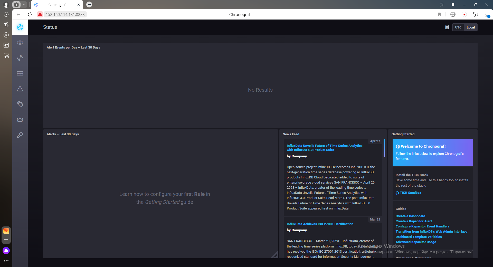
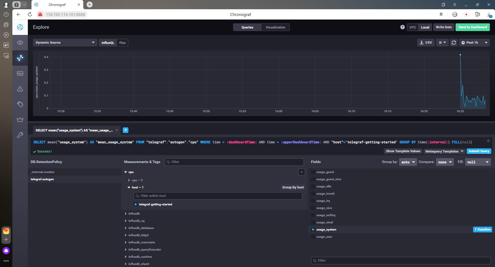

# Домашнее задание к занятию "13.Системы мониторинга"

## Обязательные задания

1. Вас пригласили настроить мониторинг на проект. На онбординге вам рассказали, что проект представляет из себя 
платформу для вычислений с выдачей текстовых отчетов, которые сохраняются на диск. Взаимодействие с платформой 
осуществляется по протоколу http. Также вам отметили, что вычисления загружают ЦПУ. Какой минимальный набор метрик вы
выведите в мониторинг и почему?

В мониторинг вывел бы следующие метрики:

1. Метрики утилизации CPU, чтобы отслеживать загрузку процессора сервисом
2. Метрики RAM, чтобы отслеживать количество занятой и свободной памяти
3. Метрики дисковой подсистемы: скорость чтения/записи, свободное место, состояние диска
4. Метрики LAN
5. Метрики HTTP по кодам ответов

#
2. Менеджер продукта посмотрев на ваши метрики сказал, что ему непонятно что такое RAM/inodes/CPUla. Также он сказал, 
что хочет понимать, насколько мы выполняем свои обязанности перед клиентами и какое качество обслуживания. Что вы 
можете ему предложить?

Необходимо утвердить SLA в рамках которого будут указаны SLO для требуемых метрик. Чтобы отслеживать фактический уровень обслуживания необходимо использовать SLI.

#
3. Вашей DevOps команде в этом году не выделили финансирование на построение системы сбора логов. Разработчики в свою 
очередь хотят видеть все ошибки, которые выдают их приложения. Какое решение вы можете предпринять в этой ситуации, 
чтобы разработчики получали ошибки приложения?

Можно использовать бесплатную облачную версию Sentry


#
4. Вы, как опытный SRE, сделали мониторинг, куда вывели отображения выполнения SLA=99% по http кодам ответов. 
Вычисляете этот параметр по следующей формуле: summ_2xx_requests/summ_all_requests. Данный параметр не поднимается выше 
70%, но при этом в вашей системе нет кодов ответа 5xx и 4xx. Где у вас ошибка?

Необходимо отслеживать 1xx и 3xx коды ответов. Правильная формула (summ_1xx_requests+summ_2xx_requests+summ_3xx_requests)/summ_all_requests

#
5. Опишите основные плюсы и минусы pull и push систем мониторинга.

Основные плюсы и минусы pull и push систем мониторинга

Push системы удобно использовать когда собирается большое количество метрик и неустойчивый канал связи между агентами и системой мониторинга. Можно переключать передачу данных между udp и tcp, тем самым выбирая между экономией трафика или гарантией доставки. Гибкая настройка частоты и объёма передаваемых метрик. К плюсам данной модели можно отнести её использование в динамически меняющемся окружении, т.к. метрики с агентов сами будут поступать в систему мониторинга без её дополнительной настройки.

Pull системы мониторинга позволяют контролировать источники откуда принимать метрики. Можно защитить канал связи между агентами и системой мониторинга шифрованием. Упрощённая отладка получения метрик с агентов. К минусам можно отнести сложность мониторинга динамически изменяющегося окружения

#
6. Какие из ниже перечисленных систем относятся к push модели, а какие к pull? А может есть гибридные?

    - Prometheus - Pull (Push с Pushgateway)
    - TICK - Push
    - Zabbix - Push (Pull с Zabbix Proxy)
    - VictoriaMetrics - Push/Pull, зависит от источника
    - Nagios - Pull
#
7. Склонируйте себе [репозиторий](https://github.com/influxdata/sandbox/tree/master) и запустите TICK-стэк, 
используя технологии docker и docker-compose.

Создана виртуальная машина в Yandex cloud


В виде решения на это упражнение приведите скриншот веб-интерфейса ПО chronograf (`http://localhost:8888`). 

P.S.: если при запуске некоторые контейнеры будут падать с ошибкой - проставьте им режим `Z`, например
`./data:/var/lib:Z`
#

Chronograf запущен



8. Перейдите в веб-интерфейс Chronograf (http://localhost:8888) и откройте вкладку Data explorer.
        
    - Нажмите на кнопку Add a query
    - Изучите вывод интерфейса и выберите БД telegraf.autogen
    - В `measurments` выберите cpu->host->telegraf-getting-started, а в `fields` выберите usage_system. Внизу появится график утилизации cpu.
    - Вверху вы можете увидеть запрос, аналогичный SQL-синтаксису. Поэкспериментируйте с запросом, попробуйте изменить группировку и интервал наблюдений.

Для выполнения задания приведите скриншот с отображением метрик утилизации cpu из веб-интерфейса.


Метрики утилизации CPU выведены



#
9. Изучите список [telegraf inputs](https://github.com/influxdata/telegraf/tree/master/plugins/inputs). 
Добавьте в конфигурацию telegraf следующий плагин - [docker](https://github.com/influxdata/telegraf/tree/master/plugins/inputs/docker):
```
[[inputs.docker]]
  endpoint = "unix:///var/run/docker.sock"
```

Дополнительно вам может потребоваться донастройка контейнера telegraf в `docker-compose.yml` дополнительного volume и 
режима privileged:
```
  telegraf:
    image: telegraf:1.4.0
    privileged: true
    volumes:
      - ./etc/telegraf.conf:/etc/telegraf/telegraf.conf:Z
      - /var/run/docker.sock:/var/run/docker.sock:Z
    links:
      - influxdb
    ports:
      - "8092:8092/udp"
      - "8094:8094"
      - "8125:8125/udp"
```

После настройке перезапустите telegraf, обновите веб интерфейс и приведите скриншотом список `measurments` в 
веб-интерфейсе базы telegraf.autogen . Там должны появиться метрики, связанные с docker.

Выведены метрики docker.

![Docker(./src/docker.png "Docker")
